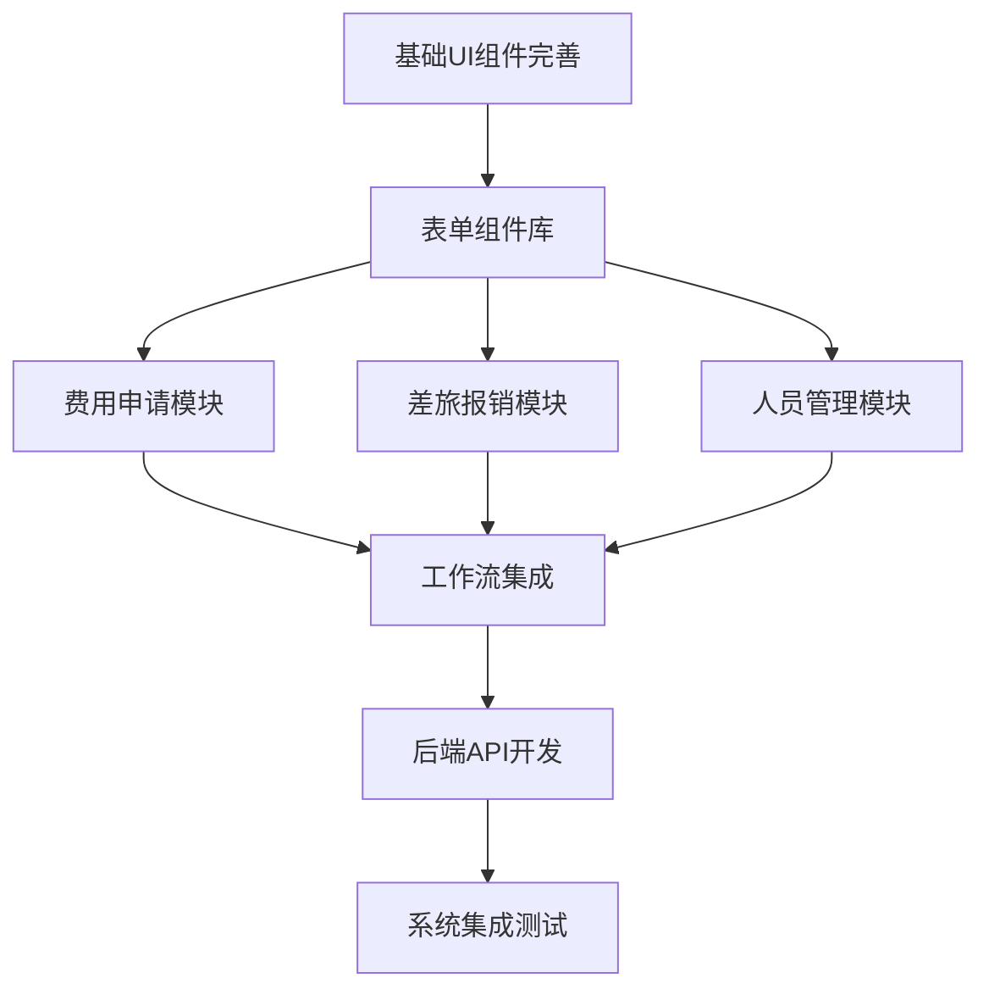

# 港交所POC系统 - AI模型沟通指南

## 🎯 指南目标

本指南旨在帮助您与AI模型高效沟通，基于现有的Next.js前端模板，分模块构建港交所POC系统。通过标准化的沟通模式和最佳实践，确保AI生成高质量、一致性强的代码。

## 📋 目录

1. [AI沟通基本原则](#1-ai沟通基本原则)
2. [项目背景信息模板](#2-项目背景信息模板)
3. [分模块开发策略](#3-分模块开发策略)
4. [标准提示词模板](#4-标准提示词模板)
5. [代码质量保证流程](#5-代码质量保证流程)
6. [具体开发场景示例](#6-具体开发场景示例)
7. [常见问题与解决方案](#7-常见问题与解决方案)

---

## 1. AI沟通基本原则

### 1.1 🔑 核心原则

**明确性优先**
- 提供具体、详细的需求描述
- 避免模糊或歧义的表达
- 明确指定技术栈和约束条件

**上下文完整性**
- 始终提供项目背景信息
- 说明当前开发阶段和模块
- 引用相关的现有代码或文档

**增量式开发**
- 一次专注一个功能模块
- 明确模块间的依赖关系
- 先完善当前模块再扩展

**质量标准统一**
- 明确代码规范和最佳实践
- 保持项目架构一致性
- 强调类型安全和错误处理

### 1.2 🚫 避免的沟通方式

❌ 模糊需求：「帮我做个表单」
✅ 具体需求：「基于我们的费用申请需求文档，创建一个包含基本信息、费用明细、审批意见三个部分的表单组件，使用React Hook Form + Zod验证」

❌ 没有上下文：「这个组件有bug」
✅ 有上下文：「在ExpenseApplicationPage组件中，当用户点击"增加明细"按钮时，新增的表单行没有正确验证，请检查并修复」

---

## 2. 项目背景信息模板

### 2.1 📄 标准项目上下文模板

在每次与AI沟通时，请包含以下标准信息：

```markdown
## 项目背景
**项目名称**: 港交所POC系统 - 费用管理与审批系统
**技术栈**: Next.js 15.2.4 + React 19 + TypeScript + Tailwind CSS + Radix UI
**开发阶段**: [当前阶段，如：前端UI开发/API集成/工作流开发]
**当前模块**: [具体模块，如：费用申请模块/差旅报销模块/人员管理模块]

## 现有架构
- 前端：基于Next.js App Router，使用组件化设计
- UI库：Radix UI + Tailwind CSS，已配置完整的设计系统
- 状态管理：React Hook Form + Zod验证
- 代码规范：TypeScript严格模式，ESLint配置

## 相关文档
- 项目需求文档：[链接或关键需求点]
- 技术方案文档：[链接或关键技术点]
- 现有组件：[相关的已存在组件]
```

### 2.2 🏗️ 架构约束说明

```markdown
## 必须遵循的架构约束
1. **组件设计**: 遵循原子化设计原则 (Atoms → Molecules → Organisms → Templates → Pages)
2. **TypeScript**: 所有组件必须有完整的类型定义
3. **样式规范**: 只使用Tailwind CSS类，遵循响应式设计
4. **表单处理**: 统一使用React Hook Form + Zod验证
5. **错误处理**: 统一的错误处理和用户反馈机制
6. **无障碍性**: 遵循ARIA标准，支持键盘导航
```

---

## 3. 分模块开发策略

### 3.1 🗂️ 开发优先级和依赖关系



### 3.2 📅 分阶段开发计划

#### 阶段1: 基础组件完善 (1-2天)
- **目标**: 完善基础UI组件库，确保设计一致性
- **重点模块**:
  - 表单组件增强 (FormField, FormSection, FormActions)
  - 数据展示组件 (DataTable, Card增强, StatusBadge)
  - 交互组件 (Modal, Toast, Loading)

#### 阶段2: 核心业务模块 (3-5天)
- **目标**: 实现三大核心功能模块的完整前端功能
- **开发顺序**:
  1. 费用申请模块 (已有基础，需要完善)
  2. 差旅报销模块 (较复杂，重点开发)
  3. 人员管理模块 (相对简单)

#### 阶段3: 工作流前端 (2-3天)
- **目标**: 实现审批流程的前端展示和交互
- **重点功能**:
  - 审批历史展示
  - 审批操作界面
  - 工作流状态可视化

#### 阶段4: 后端集成 (3-4天)
- **目标**: 开发后端API并集成前后端
- **开发重点**:
  - API设计和实现
  - 数据库设计
  - 工作流引擎集成

---

## 4. 可直接使用的提示词集合

### 4.1 🎨 基础组件开发提示词

#### 提示词1: 表单字段组件增强
```markdown
基于港交所POC系统，我需要增强现有的表单组件。

**项目背景**: 港交所POC系统 - 费用管理与审批系统
**技术栈**: Next.js 15.2.4 + React 19 + TypeScript + Tailwind CSS + Radix UI  
**开发阶段**: 前端UI组件完善
**目标文件**: fronted/components/ui/ 目录下

**具体需求**: 
基于现有的 Input, Label, Button 组件，创建三个复合表单字段组件：
1. FormField - 标准表单字段（包含Label + Input + 错误提示）
2. FormSelect - 下拉选择字段（包含Label + Select + 错误提示）  
3. FormTextarea - 文本区域字段（包含Label + Textarea + 错误提示）

**技术要求**:
- 使用现有的 @/components/ui 组件作为基础
- 集成 React Hook Form 的 Controller
- 支持 Zod 验证错误显示
- 遵循 slate-800 标题栏样式规范
- 支持必填字段标识（红色星号）
- 完整的 TypeScript 类型定义

**参考文件**: 
- fronted/components/expense-application-page.tsx (参考现有表单结构)
- fronted/components/ui/input.tsx (基础输入组件)
- fronted/components/ui/label.tsx (基础标签组件)

请提供完整的组件实现，包括 TypeScript 接口定义和使用示例。
```

#### 提示词2: 通用数据表格组件
```markdown
基于港交所POC系统，需要创建一个通用的 DataTable 组件。

**项目背景**: 港交所POC系统 - 费用管理与审批系统
**技术栈**: Next.js 15.2.4 + React 19 + TypeScript + Tailwind CSS + Radix UI
**开发阶段**: 前端UI组件开发
**目标文件**: fronted/components/ui/data-table.tsx

**功能需求**:
- 数据展示：支持灵活的列定义和数据渲染
- 排序功能：点击列标题进行升序/降序排序
- 分页功能：支持前端分页，显示页码和跳转
- 行选择：支持单选和多选，带全选功能
- 加载状态：显示 loading 和 error 状态
- 响应式：移动端自适应显示

**设计要求**:
- 使用 slate-800 作为表头背景色
- 遵循现有的卡片和按钮样式
- 支持深色主题适配
- 符合 ARIA 无障碍标准

**参考文件**:
- fronted/components/data-management-page.tsx (参考现有表格布局)
- fronted/components/ui/table.tsx (基础表格组件)
- fronted/components/ui/button.tsx (操作按钮样式)
- fronted/components/ui/checkbox.tsx (行选择功能)

**类型接口**:
```typescript
interface DataTableProps<T extends Record<string, any>> {
  data: T[];
  columns: ColumnDef<T>[];
  loading?: boolean;
  error?: string;
  pagination?: PaginationConfig;
  selection?: SelectionConfig;
  onRowSelect?: (row: T) => void;
  className?: string;
}
```

请提供完整的 DataTable 组件实现，包括相关子组件和完整的 TypeScript 类型定义。
```

### 4.2 🔧 业务模块功能提示词

#### 提示词3: 完善费用申请表单验证
```markdown
基于港交所POC系统，需要完善费用申请模块的表单验证功能。

**项目背景**: 港交所POC系统 - 费用管理与审批系统
**技术栈**: Next.js 15.2.4 + React 19 + TypeScript + Tailwind CSS + Radix UI
**开发阶段**: 核心业务模块开发
**目标文件**: fronted/components/expense-application-page.tsx
**相关需求**: 项目需求文档 > 2.1.1 日常费用申请模块 > 基本信息管理 & 费用明细管理

**当前状态**:
- ✅ 基本表单结构已完成（参考现有的 ExpenseApplicationPage 组件）
- ✅ 使用了 Radix UI 组件（Card, Input, Select, Button 等）
- ❌ 缺少完整的表单验证机制
- ❌ 费用明细的动态增删操作需要改进
- ❌ 缺少表单数据的自动保存功能

**具体增强需求**:
1. **集成 React Hook Form + Zod 验证**:
   - 申请人、部门、公司等基本信息验证
   - 费用明细数组的验证（至少一条，金额必须大于0）
   - 实时验证和友好的错误提示显示

2. **费用明细动态管理**:
   - 优化"增加明细"、"删除明细"的交互体验
   - 添加批量删除功能
   - 支持明细项的拖拽排序

3. **用户体验改进**:
   - 自动保存草稿功能（每30秒保存到 localStorage）
   - 页面刷新后的数据恢复
   - 提交前的确认对话框

**技术约束**:
- 保持现有的 UI 设计风格和组件结构
- 使用 TypeScript 严格类型检查
- 确保响应式设计和无障碍性
- 错误处理要友好且一致

**参考实现**:
- 项目需求文档第2章功能需求作为业务逻辑参考
- 现有的 fronted/components/travel-expense-page.tsx 中的表单处理模式
- fronted/lib/utils.ts 中的工具函数

请提供完整的表单验证逻辑、相关 TypeScript 类型定义和组件改进代码。
```

#### 提示词4: 开发工作流可视化组件
```markdown
基于港交所POC系统，需要开发工作流可视化组件来展示审批流程。

**项目背景**: 港交所POC系统 - 费用管理与审批系统
**技术栈**: Next.js 15.2.4 + React 19 + TypeScript + Tailwind CSS + Radix UI
**开发阶段**: 工作流前端开发
**目标文件**: fronted/components/workflow-visualizer.tsx
**相关需求**: 项目需求文档 > 2.2 工作流审批系统 > 2.2.1 工作流节点定义

**工作流节点信息**（来自需求文档2.2.1章节）:
1. 申请发起人（起始节点）
2. AA1资格审批
3. 直属主管审批  
4. GHBC财务组审批
5. GHBC合规组审批
6. Functional Head审批
7. COO/CEO审批
8. 审批完成/拒绝（结束节点）

**功能需求**:
- **状态可视化**: 当前节点高亮（blue-600），已完成节点绿色勾选，待处理节点灰色，拒绝节点红色
- **交互功能**: 点击节点显示详细信息（审批人、时间、意见）
- **连线动画**: 节点间的流程连线，支持动态高亮当前路径
- **响应式布局**: 支持水平和垂直布局切换，移动端优化

**数据结构**:
```typescript
interface WorkflowInstance {
  id: string;
  status: 'running' | 'completed' | 'rejected';
  currentStep: string;
  steps: WorkflowStep[];
}

interface WorkflowStep {
  id: string;
  name: string;
  type: 'start' | 'approval' | 'end';
  status: 'pending' | 'in-progress' | 'completed' | 'rejected';
  assignee?: string;
  approver?: string;
  approvedAt?: Date;
  comment?: string;
}
```

**设计要求**:
- 使用项目主色调 blue-600 和 slate-800
- 节点采用圆角矩形设计，连线使用 SVG
- 添加适当的 hover 和点击动画效果
- 符合现有组件的视觉一致性

**使用场景**:
- 集成到费用申请详情页面
- 作为独立的审批历史查看组件
- 管理员工作流监控界面

请提供完整的 WorkflowVisualizer 组件实现，包括 SVG 连线逻辑、状态管理和 TypeScript 类型定义。
```

### 4.3 🔧 模块集成和优化提示词

#### 提示词5: 完善差旅报销模块的多币种处理
```markdown
基于港交所POC系统，需要完善差旅报销模块的多币种和汇率计算功能。

**项目背景**: 港交所POC系统 - 费用管理与审批系统
**技术栈**: Next.js 15.2.4 + React 19 + TypeScript + Tailwind CSS + Radix UI
**开发阶段**: 核心业务模块开发
**目标文件**: fronted/components/travel-expense-page.tsx
**相关需求**: 项目需求文档 > 2.1.2 差旅费报销模块 > 费用明细管理

**当前状态**:
- ✅ 基本的差旅报销表单结构已完成（参考现有的 TravelExpensePage 组件）
- ✅ 费用明细表格的基础功能（增删改）
- ❌ 多币种选择和汇率自动计算功能不完善
- ❌ 发票金额与人民币金额的实时换算
- ❌ 汇率数据的获取和缓存机制

**具体增强需求**:
1. **多币种支持**:
   - 币种下拉选择（港币、美元、人民币、欧元等）
   - 实时汇率获取（可模拟API或使用固定汇率）
   - 发票金额输入后自动计算人民币金额

2. **汇率计算逻辑**:
   - 汇率变化时自动重新计算所有明细
   - 支持手动修改汇率（保留用户自定义汇率）
   - 汇率历史记录和缓存机制

3. **用户体验改进**:
   - 汇率获取的 loading 状态显示
   - 计算结果的动画效果
   - 币种切换时的确认提示

**数据结构**:
```typescript
interface TravelExpenseItem {
  id: string;
  category: string;
  expenseDate: Date;
  currency: string;
  exchangeRate: number;
  invoiceAmount: number;
  rmbAmount: number;
  remark?: string;
}

interface ExchangeRate {
  currency: string;
  rate: number;
  lastUpdated: Date;
}
```

**技术要求**:
- 保持现有的表格布局和交互模式
- 使用 TypeScript 严格类型检查
- 实现汇率计算的防抖处理
- 错误处理和边界情况考虑

**参考实现**:
- 现有的 fronted/components/travel-expense-page.tsx 中的费用明细表格
- 项目需求文档 2.1.2 章节中的多币种支持要求
- fronted/components/ui/select.tsx 用于币种选择

请提供完整的多币种处理逻辑、汇率计算组件和相关的 TypeScript 类型定义。
```

#### 提示词6: 开发人员管理的批量操作功能
```markdown
基于港交所POC系统，需要为人员管理模块添加批量操作功能。

**项目背景**: 港交所POC系统 - 费用管理与审批系统
**技术栈**: Next.js 15.2.4 + React 19 + TypeScript + Tailwind CSS + Radix UI
**开发阶段**: 核心业务模块开发
**目标文件**: fronted/components/data-management-page.tsx
**相关需求**: 项目需求文档 > 2.1.3 人员信息管理模块 > 人员操作

**当前状态**:
- ✅ 基本的人员列表展示（参考现有的 DataManagementPage 组件）
- ✅ 单个人员的基础操作（录入、修改、删除）
- ❌ 批量选择和批量操作功能
- ❌ 批量导入/导出功能
- ❌ 操作确认和进度显示

**具体增强需求**:
1. **批量选择功能**:
   - 表头全选/取消全选 checkbox
   - 单行选择和跨页选择支持
   - 选中状态的视觉反馈
   - 选中数量的实时显示

2. **批量操作**:
   - 批量删除（带确认对话框）
   - 批量修改部门/状态
   - 批量工作调动
   - 批量导出选中人员数据

3. **操作反馈**:
   - 批量操作的进度条显示
   - 操作结果的成功/失败统计
   - 错误信息的详细展示
   - 操作日志记录

**功能设计**:
```typescript
interface PersonSelection {
  selectedIds: string[];
  selectAll: boolean;
  indeterminate: boolean;
}

interface BatchOperation {
  type: 'delete' | 'update' | 'transfer' | 'export';
  targetIds: string[];
  payload?: any;
}

interface OperationResult {
  success: number;
  failed: number;
  errors: string[];
}
```

**UI组件需求**:
- 批量操作工具栏（选中时显示）
- 操作确认对话框组件
- 进度指示器组件
- 结果统计显示组件

**技术要求**:
- 基于现有的 DataTable 组件扩展
- 使用 React Hook 管理批量选择状态
- 实现操作的乐观更新和回滚机制
- 符合现有的设计系统规范

**参考实现**:
- 现有的 fronted/components/data-management-page.tsx 中的人员列表
- fronted/components/ui/checkbox.tsx 用于选择功能
- 项目需求文档 2.1.3 章节中的批量操作要求

请提供完整的批量操作功能实现，包括选择状态管理、操作确认流程和结果反馈机制。
```

---

## 5. 代码质量保证流程

### 5.1 ✅ 代码review检查清单

#### TypeScript类型安全
```typescript
// ✅ 好的类型定义示例
interface ExpenseFormData {
  applicantId: string;
  departmentId: string;
  company: 'CHC' | 'GHBC' | 'HEXE';
  applyDate: Date;
  description: string;
  items: ExpenseItem[];
}

interface ExpenseItem {
  id: string;
  category: string;
  purpose: string;
  amount: number;
}

// ❌ 避免使用any或过于宽泛的类型
interface BadFormData {
  [key: string]: any; // 不好
}
```

#### 组件接口设计
```typescript
// ✅ 好的组件接口设计
interface DataTableProps<T extends Record<string, any>> {
  data: T[];
  columns: ColumnDefinition<T>[];
  loading?: boolean;
  error?: string;
  onRowSelect?: (row: T) => void;
  onSort?: (column: keyof T, direction: 'asc' | 'desc') => void;
  className?: string;
  'data-testid'?: string;
}

// ❌ 避免的设计模式
interface BadTableProps {
  data: any[]; // 类型不明确
  config: any; // 配置不清晰
  callback: Function; // 函数类型不明确
}
```

#### 错误处理模式
```typescript
// ✅ 好的错误处理
const [data, setData] = useState<ExpenseData[]>([]);
const [loading, setLoading] = useState(false);
const [error, setError] = useState<string | null>(null);

const fetchData = async () => {
  try {
    setLoading(true);
    setError(null);
    const result = await api.getExpenses();
    setData(result.data);
  } catch (err) {
    setError(err instanceof Error ? err.message : '获取数据失败');
    console.error('Failed to fetch expenses:', err);
  } finally {
    setLoading(false);
  }
};

// ❌ 避免的错误处理
const fetchData = async () => {
  const result = await api.getExpenses(); // 没有错误处理
  setData(result.data);
};
```

### 5.2 🎯 性能优化检查点

#### React组件优化
```typescript
// ✅ 使用React.memo优化重渲染
const ExpenseItem = React.memo<ExpenseItemProps>(({ 
  item, 
  onEdit, 
  onDelete 
}) => {
  return (
    <Card className="p-4">
      <div className="flex justify-between items-center">
        <div>
          <h3 className="font-medium">{item.category}</h3>
          <p className="text-sm text-gray-500">{item.purpose}</p>
        </div>
        <div className="flex space-x-2">
          <Button size="sm" onClick={() => onEdit(item.id)}>
            编辑
          </Button>
          <Button size="sm" variant="destructive" onClick={() => onDelete(item.id)}>
            删除
          </Button>
        </div>
      </div>
    </Card>
  );
});

// ✅ 使用useCallback优化函数依赖
const ExpenseList: React.FC<ExpenseListProps> = ({ expenses, onUpdate }) => {
  const handleEdit = useCallback((id: string) => {
    // 编辑逻辑
  }, [onUpdate]);

  const handleDelete = useCallback(async (id: string) => {
    try {
      await api.deleteExpense(id);
      onUpdate();
    } catch (error) {
      console.error('删除失败:', error);
    }
  }, [onUpdate]);

  return (
    <div className="space-y-4">
      {expenses.map(expense => (
        <ExpenseItem
          key={expense.id}
          item={expense}
          onEdit={handleEdit}
          onDelete={handleDelete}
        />
      ))}
    </div>
  );
};
```

---

## 6. 具体开发场景示例

### 6.1 💼 场景1: 完善费用申请表单

**与AI的对话示例**:

```markdown
## 请求背景
我正在开发港交所POC系统的费用申请模块。现有的ExpenseApplicationPage组件已经实现了基本功能，但需要完善表单验证和用户体验。

## 现有代码状态
- ✅ 基本表单结构已完成
- ✅ 使用了Radix UI组件
- ❌ 缺少完整的表单验证  
- ❌ 费用明细的增删操作不够流畅
- ❌ 缺少保存草稿功能

## 具体需求
1. **表单验证增强**: 
   - 使用React Hook Form + Zod
   - 实时验证用户输入
   - 友好的错误提示

2. **费用明细改进**:
   - 流畅的增加/删除动画
   - 拖拽排序功能
   - 批量操作支持

3. **用户体验优化**:
   - 自动保存草稿 (每30秒)
   - 表单数据恢复 (页面刷新后)
   - 操作确认对话框

## 技术要求
- 保持现有的UI设计风格
- 使用TypeScript严格类型检查
- 确保无障碍性支持
- 添加适当的loading状态

## 期望交付
1. 完整的表单验证逻辑
2. 改进的费用明细组件
3. 草稿保存和恢复功能
4. 相关的TypeScript类型定义

请先提供整体的实现方案，然后我们逐步实现每个功能点。
```

### 6.2 📊 场景2: 创建数据表格组件

**与AI的对话示例**:

```markdown
## 组件开发需求
基于我们的设计系统，需要创建一个通用的DataTable组件，用于人员管理模块的数据展示。

## 功能需求
### 基础功能
- 数据展示：支持不同数据类型的列
- 排序：点击列标题排序
- 分页：支持前端和后端分页
- 选择：单选/多选行
- 操作：行级别的操作按钮

### 高级功能  
- 筛选：列筛选和全局搜索
- 导出：支持CSV/Excel导出
- 列控制：显示/隐藏列
- 响应式：移动端适配

## 技术规范
```typescript
// 期望的接口设计
interface DataTableProps<T extends Record<string, any>> {
  data: T[];
  columns: ColumnDef<T>[];
  loading?: boolean;
  error?: string;
  pagination?: {
    page: number;
    pageSize: number;
    total: number;
    onPageChange: (page: number) => void;
  };
  selection?: {
    selectedRows: string[];
    onSelectionChange: (selectedIds: string[]) => void;
  };
  sorting?: {
    sortBy?: keyof T;
    sortOrder?: 'asc' | 'desc';
    onSort: (column: keyof T, order: 'asc' | 'desc') => void;
  };
  actions?: TableAction<T>[];
  className?: string;
}

interface ColumnDef<T> {
  key: keyof T;
  title: string;
  width?: number;
  sortable?: boolean;
  filterable?: boolean;
  render?: (value: T[keyof T], row: T) => React.ReactNode;
}
```

## 设计要求
- 遵循我们的色彩系统 (slate-800标题栏)
- 使用Tailwind CSS实现响应式
- 支持深色主题
- 符合ARIA无障碍标准

## 参考现有组件
- 现有的Table组件作为基础
- 参考DataManagementPage的表格布局
- 保持与现有按钮和表单组件的视觉一致性

请提供完整的组件实现，包括：
1. 主要的DataTable组件
2. 相关的子组件 (TableHeader, TableRow等)
3. 完整的TypeScript类型定义
4. 使用示例
```

### 6.3 🚀 完整提示词库

基于港交所POC系统的实际开发需求，以下是可直接复制使用的提示词集合：

#### 📋 提示词1: StatusBadge组件开发
```markdown
基于港交所POC系统，需要创建通用的 StatusBadge 组件。

**项目背景**: 港交所POC系统 - 费用管理与审批系统
**技术栈**: Next.js 15.2.4 + React 19 + TypeScript + Tailwind CSS + Radix UI
**目标文件**: fronted/components/ui/status-badge.tsx
**参考文件**: fronted/components/data-management-page.tsx（查看现有状态显示）

**功能需求**: 
- 显示不同状态的徽章（草稿、审批中、已通过、已拒绝等）
- 支持自定义颜色和图标
- 响应式设计，移动端适配
- 支持点击事件和 hover 效果

**状态定义**:
```typescript
type StatusType = 'draft' | 'pending' | 'approved' | 'rejected' | 'in-progress';
interface StatusBadgeProps {
  status: StatusType;
  children?: React.ReactNode;
  onClick?: () => void;
  className?: string;
}
```

**设计要求**: 使用 slate-800/blue-600/green-600/red-600 配色，圆角设计，符合现有按钮样式。

请提供完整的 StatusBadge 组件实现和 TypeScript 类型定义。
```

#### 📋 提示词2: 表单验证增强
```markdown
基于港交所POC系统，需要为 ExpenseApplicationPage 组件添加完整的表单验证。

**项目背景**: 港交所POC系统 - 费用管理与审批系统
**技术栈**: Next.js 15.2.4 + React 19 + TypeScript + Tailwind CSS + Radix UI
**目标文件**: fronted/components/expense-application-page.tsx
**相关需求**: 项目需求文档 > 2.1.1 日常费用申请模块

**当前状态**: 基本表单结构已完成，缺少验证机制
**具体需求**:
1. 集成 React Hook Form + Zod 验证
2. 申请人、部门、金额等字段验证
3. 费用明细数组验证（至少一条，金额>0）
4. 实时错误提示显示

**验证规则**:
- 申请人：必填，最少2个字符
- 申请日期：必填，不能超过当前日期
- 费用明细：至少一条，每条金额必须>0
- 事由描述：必填，最少10个字符

**技术要求**: 保持现有UI风格，添加错误状态样式，使用 TypeScript 严格类型。

请提供完整的表单验证逻辑和相关 Hook 实现。
```

#### 📋 提示词3: 工作流可视化组件
```markdown
基于港交所POC系统，需要开发工作流状态追踪组件。

**项目背景**: 港交所POC系统 - 费用管理与审批系统
**技术栈**: Next.js 15.2.4 + React 19 + TypeScript + Tailwind CSS + Radix UI
**目标文件**: fronted/components/workflow-tracker.tsx
**相关需求**: 项目需求文档 > 2.2 工作流审批系统

**工作流节点**（需求文档2.2.1章节）:
申请发起人 → AA1资格审批 → 直属主管审批 → GHBC财务组审批 → GHBC合规组审批 → Functional Head审批 → COO/CEO审批 → 审批完成

**功能需求**:
1. 步骤可视化：显示8个审批节点的状态
2. 状态标识：当前(蓝色)、已完成(绿色)、待处理(灰色)、拒绝(红色)
3. 详情显示：点击节点显示审批人、时间、意见
4. 响应式：水平布局(桌面)、垂直布局(移动端)

**数据结构**:
```typescript
interface WorkflowStep {
  id: string;
  name: string;
  status: 'pending' | 'in-progress' | 'completed' | 'rejected';
  approver?: string;
  approvedAt?: Date;
  comment?: string;
}
```

**设计要求**: 使用蓝色主题，步骤间连线，支持点击展开详情。

请提供完整的 WorkflowTracker 组件实现，包括状态管理和响应式布局。
```

#### 📋 提示词4: 多币种差旅报销功能
```markdown
基于港交所POC系统，需要完善差旅报销模块的多币种和汇率计算功能。

**项目背景**: 港交所POC系统 - 费用管理与审批系统
**技术栈**: Next.js 15.2.4 + React 19 + TypeScript + Tailwind CSS + Radix UI
**目标文件**: fronted/components/travel-expense-page.tsx
**相关需求**: 项目需求文档 > 2.1.2 差旅费报销模块 > 费用明细管理

**当前状态**:
- ✅ 基本的差旅报销表单结构已完成（参考现有的 TravelExpensePage 组件）
- ✅ 费用明细表格的基础功能（增删改）
- ❌ 多币种选择和汇率自动计算功能不完善
- ❌ 发票金额与人民币金额的实时换算

**具体增强需求**:
1. **多币种支持**: 币种下拉选择（港币、美元、人民币、欧元等）
2. **汇率计算**: 实时汇率获取（可模拟API或使用固定汇率）
3. **金额换算**: 发票金额输入后自动计算人民币金额
4. **用户体验**: 汇率获取的 loading 状态显示，计算结果的动画效果

**数据结构**:
```typescript
interface TravelExpenseItem {
  id: string;
  category: string;
  expenseDate: Date;
  currency: string;
  exchangeRate: number;
  invoiceAmount: number;
  rmbAmount: number;
  remark?: string;
}
```

**技术要求**: 保持现有表格布局，使用 TypeScript 严格类型检查，添加汇率计算防抖处理。

请提供完整的多币种处理逻辑、汇率计算组件和相关的 TypeScript 类型定义。
```

#### 📋 提示词5: 人员管理批量操作功能
```markdown
基于港交所POC系统，需要为人员管理模块添加批量操作功能。

**项目背景**: 港交所POC系统 - 费用管理与审批系统
**技术栈**: Next.js 15.2.4 + React 19 + TypeScript + Tailwind CSS + Radix UI
**目标文件**: fronted/components/data-management-page.tsx
**相关需求**: 项目需求文档 > 2.1.3 人员信息管理模块 > 人员操作

**当前状态**: 基本的人员列表展示（参考现有的 DataManagementPage 组件），缺少批量操作功能

**具体增强需求**:
1. **批量选择功能**: 表头全选/取消全选，单行选择，选中状态的视觉反馈
2. **批量操作**: 批量删除（带确认对话框），批量修改部门/状态，批量导出数据
3. **操作反馈**: 批量操作的进度条显示，操作结果的成功/失败统计

**功能设计**:
```typescript
interface PersonSelection {
  selectedIds: string[];
  selectAll: boolean;
  indeterminate: boolean;
}

interface BatchOperation {
  type: 'delete' | 'update' | 'transfer' | 'export';
  targetIds: string[];
  payload?: any;
}
```

**UI组件需求**: 批量操作工具栏（选中时显示），操作确认对话框组件，进度指示器组件

**技术要求**: 基于现有的 DataTable 组件扩展，使用 React Hook 管理批量选择状态。

请提供完整的批量操作功能实现，包括选择状态管理、操作确认流程和结果反馈机制。
```

#### 📋 提示词6: Bug修复示例
```markdown
港交所POC系统 ExpenseApplicationPage 组件存在表单提交问题。

**项目背景**: 港交所POC系统 - 费用管理与审批系统
**目标文件**: fronted/components/expense-application-page.tsx
**Bug描述**: 点击"提交申请"按钮后，表单数据未正确提交，页面无响应

**复现步骤**:
1. 打开费用申请页面 (ExpenseApplicationPage)
2. 填写申请人、选择部门、输入费用明细
3. 点击"提交申请"按钮
4. 期望：显示提交成功提示，实际：按钮无响应

**技术环境**: Chrome 最新版本，开发环境
**相关代码**: fronted/components/expense-application-page.tsx 中的表单提交逻辑

**修复目标**: 
- 修复表单提交功能
- 添加提交中的 loading 状态
- 添加成功/失败的用户反馈
- 确保表单验证正常工作

请分析问题原因并提供修复代码，保持现有的UI样式不变。
```

---

## 7. 常见问题与解决方案

### 7.1 ❓ 常见沟通问题

#### Q1: AI生成的组件与现有设计风格不一致
**解决方案**:
```markdown
## 设计规范指引
在每次请求中明确包含：

### 色彩规范
- 主要色彩：slate-800 (深色标题栏), blue-600 (主色调)
- 状态色彩：green-600 (成功), red-600 (错误), yellow-600 (警告)
- 文字色彩：gray-900 (主要文字), gray-600 (次要文字)

### 间距规范  
- 组件间距：space-y-4 或 space-y-6
- 内边距：p-4 (卡片), p-6 (页面内容)
- 按钮间距：space-x-2 (小间距), space-x-4 (正常间距)

### 组件规范
- 按钮：使用我们的Button组件变体
- 输入框：统一使用Input + Label组合
- 卡片：Card + CardHeader + CardContent结构
```

#### Q2: 组件功能过于复杂，难以维护
**解决方案**:
```markdown
## 复杂组件分解策略
1. **单一职责原则**: 每个组件只负责一个主要功能
2. **组合优于继承**: 使用多个小组件组合复杂功能  
3. **抽取自定义Hook**: 将复杂逻辑抽取到Hook中

### 示例分解
不要：一个大的ExpenseForm组件
推荐：
- ExpenseBasicInfo (基本信息)
- ExpenseItemList (费用明细列表)  
- ExpenseItemForm (单个明细表单)
- ExpenseActions (操作按钮组)
```

#### Q3: TypeScript类型定义不够准确
**解决方案**:
```markdown
## TypeScript最佳实践
### 严格类型检查
- 启用 strict: true
- 使用具体的联合类型而不是string
- 为所有Props定义完整接口

### 类型复用
- 创建共享的types文件
- 使用泛型提高复用性
- 导出常用的类型定义

### 示例
```typescript
// types/expense.ts
export interface ExpenseApplication {
  id: string;
  applicationNumber: string;
  applicantId: string; 
  status: ExpenseStatus;
  totalAmount: number;
  items: ExpenseItem[];
}

export type ExpenseStatus = 'draft' | 'pending' | 'approved' | 'rejected';
```

### 7.2 🔧 开发效率提升技巧

#### 技巧1: 使用代码模板
```markdown
创建标准的组件模板，让AI基于模板生成代码：

## React组件模板
```typescript
import React from 'react';
import { cn } from '@/lib/utils';

interface [ComponentName]Props {
  className?: string;
  children?: React.ReactNode;
  // 其他属性
}

export const [ComponentName]: React.FC<[ComponentName]Props> = ({
  className,
  children,
  ...props
}) => {
  return (
    <div className={cn("基础样式类", className)} {...props}>
      {children}
    </div>
  );
};

[ComponentName].displayName = '[ComponentName]';
```

#### 技巧2: 批量处理相似组件
```markdown
## 批量组件请求
当需要创建多个相似组件时，可以这样请求：

请基于以下模式，创建三个表单字段组件：
1. TextFieldGroup - 文本输入字段组
2. SelectFieldGroup - 下拉选择字段组  
3. DateFieldGroup - 日期选择字段组

每个组件都应该包含：
- Label标签
- 输入控件
- 错误信息显示
- 帮助文本
- 必填标识

请保持接口一致性，都继承自BaseFieldProps。
```

#### 技巧3: 渐进式增强
```markdown
## 渐进式开发请求
第一步：请创建一个基础的DataTable组件，只包含数据展示功能
第二步：为DataTable添加排序功能
第三步：为DataTable添加分页功能
第四步：为DataTable添加行选择功能

这样可以确保每一步都能正常工作，便于测试和调试。
```

---

## 8. 提示词最佳实践总结

### 8.1 🎯 高质量提示词要素

#### 1. 完整的上下文信息
```markdown
✅ 好的示例：
"我正在开发港交所POC系统的费用申请模块。项目使用Next.js + TypeScript + Tailwind CSS。现有ExpenseApplicationPage组件缺少表单验证功能，请帮我添加React Hook Form + Zod验证，需要验证申请人、费用明细等字段。"

❌ 不好的示例：
"帮我添加表单验证"
```

#### 2. 具体的技术要求
```markdown
✅ 好的示例：
"使用React Hook Form进行表单管理，Zod进行数据验证，错误信息要显示在字段下方，使用红色文字，验证规则包括：申请人不能为空，金额必须大于0。"

❌ 不好的示例：
"添加一些验证"
```

#### 3. 明确的预期结果
```markdown
✅ 好的示例：
"期望得到：1) 完整的表单验证逻辑代码，2) 相关的TypeScript类型定义，3) 错误处理机制，4) 简单的使用示例"

❌ 不好的示例：
"给我一些代码"
```

### 8.2 📝 提示词模板速查

#### 新组件开发
```markdown
【组件名称】+ 【功能描述】+ 【技术栈】+ 【设计要求】+ 【接口定义】+ 【使用场景】
```

#### 功能增强
```markdown
【现有代码状态】+ 【问题描述】+ 【期望功能】+ 【技术约束】+ 【测试要求】
```

#### Bug修复
```markdown
【Bug现象】+ 【复现步骤】+ 【错误信息】+ 【相关代码】+ 【修复目标】
```

#### 性能优化
```markdown
【性能问题】+ 【当前指标】+ 【目标指标】+ 【优化约束】+ 【测试方法】
```

---

## 9. 开发流程检查清单

### 9.1 ✅ 开发前检查

- [ ] 确认当前开发阶段和模块
- [ ] 准备相关的需求文档内容
- [ ] 检查现有相关组件和代码
- [ ] 明确技术栈和依赖约束
- [ ] 准备完整的类型定义需求

### 9.2 ✅ 与AI沟通检查

- [ ] 提供完整的项目背景信息
- [ ] 使用具体、明确的需求描述  
- [ ] 包含技术约束和质量要求
- [ ] 指定期望的交付物和格式
- [ ] 准备相关的参考代码或组件

### 9.3 ✅ 代码review检查

- [ ] TypeScript类型定义完整准确
- [ ] 组件接口设计合理易用
- [ ] 错误处理机制完善
- [ ] 性能优化措施到位  
- [ ] 无障碍性支持充分
- [ ] 代码风格符合项目规范

### 9.4 ✅ 测试验证检查

- [ ] 基本功能正常工作
- [ ] 边界情况处理正确
- [ ] 错误状态显示友好
- [ ] 响应式设计适配良好
- [ ] 无障碍性测试通过

---

## 🎉 总结

通过遵循本指南的沟通模式和最佳实践，您可以：

1. **提高AI代码生成质量** - 通过明确的需求描述和完整的上下文信息
2. **确保代码一致性** - 通过标准化的模板和规范约束
3. **加速开发进度** - 通过合理的模块化分工和渐进式开发
4. **保证项目质量** - 通过完善的检查清单和最佳实践

记住：**好的输入产生好的输出**。投入时间准备高质量的提示词，将大大提升开发效率和代码质量。

---

**版本**: 1.0  
**更新日期**: 2024年1月  
**适用项目**: 港交所POC系统及类似的React/Next.js项目 