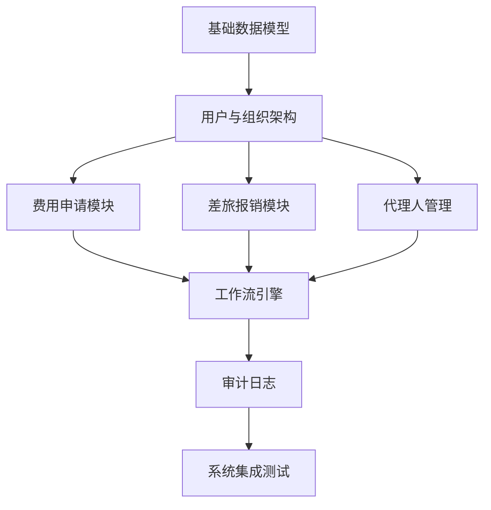

# 港交所POC系统后端开发AI沟通指南

## 🎯 指南目标

本指南旨在帮助开发者与AI模型高效沟通，基于现有的PostgreSQL数据库和前端模板，分模块构建港交所POC系统后端。通过标准化的沟通模式和最佳实践，确保AI生成高质量、一致性强的Spring Boot后端代码。

## 📋 目录

1. [AI沟通基本原则](#1-ai沟通基本原则)
2. [项目背景信息模板](#2-项目背景信息模板)
3. [数据库环境信息](#3-数据库环境信息)
4. [分模块开发策略](#4-分模块开发策略)
5. [标准提示词模板](#5-标准提示词模板)
6. [具体开发场景示例](#6-具体开发场景示例)
7. [前端测试验证指南](#7-前端测试验证指南)

---

## 1. AI沟通基本原则

### 1.1 🔑 核心原则

**明确性优先**
- 提供具体、详细的需求描述
- 明确指定技术栈和架构约束
- 说明与前端页面的对接关系

**数据库优先**
- 始终考虑现有数据库连接配置
- 明确表结构设计和关联关系
- 确保数据持久化要求

**前后端协调**
- 明确API接口格式要求
- 考虑前端页面的数据需求
- 确保跨域和数据格式兼容

**架构一致性**
- 遵循Spring Boot分层架构
- 保持代码风格和命名规范
- 确保事务管理和异常处理

---

## 2. 项目背景信息模板

### 2.1 📄 标准项目上下文模板

```markdown
## 项目背景
**项目名称**: 港交所POC系统 - 费用管理与审批系统
**后端技术栈**: Spring Boot 2.7.18 + PostgreSQL + JPA/Hibernate + Maven
**前端技术栈**: Next.js 15.2.4 + React 19 + TypeScript + Tailwind CSS
**开发阶段**: [当前阶段，如：API开发/数据模型设计/工作流集成]
**当前模块**: [具体模块，如：费用申请模块/用户管理模块/工作流模块]

## 数据库环境
**数据库类型**: PostgreSQL 13+
**连接地址**: jdbc:postgresql://1.15.34.167:5432/hkex_poc
**用户名**: hkex_user
**密码**: hkex_password_2024
**状态**: 已部署且可用，支持DDL自动创建

## 现有架构
**包结构**: demo.backed.[controller|service|repository|entity|dto|config]
**API前缀**: /api/[模块名]
**响应格式**: 统一JSON响应格式
**异常处理**: 全局异常处理器
**文档**: Swagger/OpenAPI自动生成

## 前端对接页面
[根据开发模块指定对应的前端页面文件]
```

---

## 3. 数据库环境信息

### 3.1 🗄️ 数据库连接配置

**已配置的数据库连接**:
```properties
spring.datasource.url=jdbc:postgresql://1.15.34.167:5432/hkex_poc
spring.datasource.username=hkex_user
spring.datasource.password=hkex_password_2024
spring.datasource.driver-class-name=org.postgresql.Driver
spring.jpa.hibernate.ddl-auto=update
```

**连接池配置**:
```properties
spring.datasource.hikari.maximum-pool-size=20
spring.datasource.hikari.minimum-idle=5
spring.datasource.hikari.connection-timeout=30000
```

### 3.2 📊 表命名规范

```sql
-- 表名规范 (所有表以 t_poc_ 开头)
t_poc_users                    -- 用户表
t_poc_departments             -- 部门表  
t_poc_expense_applications    -- 费用申请表
t_poc_expense_items           -- 费用明细表
t_poc_workflow_instances      -- 工作流实例表
t_poc_workflow_nodes          -- 工作流节点表
t_poc_audit_logs             -- 审计日志表
t_poc_proxy_settings         -- 代理设置表
```

---

## 4. 分模块开发策略

### 4.1 🗂️ 开发优先级和依赖关系



### 4.2 📅 分阶段开发计划

#### 阶段1: 基础模块 (3-4天)
- **目标**: 建立基础数据模型和用户管理认证体系
- **模块包含**:
  - 用户管理 (User, Department, Organization) - 提示词1
  - JWT认证和安全配置 - 提示词2
  - 在线用户管理和会话追踪 - 提示词3
  - 基础CRUD操作优化 - 提示词4

#### 阶段2: 业务核心模块 (3-4天)
- **目标**: 实现费用申请和差旅报销核心功能
- **模块包含**:
  - 费用申请模块 - 提示词5
  - 差旅报销模块 - 提示词9
  - 附件管理
  - 表单定制

#### 阶段3: 工作流模块 (3-4天)
- **目标**: 实现审批流程和状态管理
- **模块包含**:
  - 工作流引擎 - 提示词6
  - 节点状态管理
  - 打回操作
  - 代理人设置 - 提示词7

#### 阶段4: 日志与集成 (2-3天)
- **目标**: 完善系统监控和前后端集成
- **模块包含**:
  - 审计日志 - 提示词8
  - 系统日志
  - API文档
  - 前后端联调

---

## 5. 标准提示词模板

### 5.1 🏗️ 基础模块开发提示词

#### 提示词1: 用户管理模块开发
```markdown
基于港交所POC系统，需要开发用户管理模块的完整后端API。

**项目背景**: 港交所POC系统 - 费用管理与审批系统
**技术栈**: Spring Boot 2.7.18 + PostgreSQL + JPA/Hibernate + Maven
**开发阶段**: 基础模块开发
**目标模块**: 用户管理模块
**对应前端页面**: fronted/components/data-management-page.tsx 和 personnel-management-page.tsx

**数据库环境**:
- 连接地址: jdbc:postgresql://1.15.34.167:5432/hkex_poc
- 用户: hkex_user / 密码: hkex_password_2024
- DDL模式: spring.jpa.hibernate.ddl-auto=update (自动创建表)

**功能需求**:
1. **用户实体设计**: 
   - 用户基本信息（姓名、工号、邮箱、电话）
   - 部门和岗位信息（支持主管/员工区分）
   - 用户状态管理（在职/离职/休假）
   - 登录相关（密码、最后登录时间、在线状态）

2. **API接口要求**:
   - GET /api/users - 获取用户列表（支持分页和搜索）
   - POST /api/users - 创建用户
   - PUT /api/users/{id} - 更新用户信息
   - DELETE /api/users/{id} - 删除用户
   - GET /api/users/online - 获取在线用户列表
   - POST /api/users/login - 用户登录
   - POST /api/users/logout - 用户登出

3. **数据模型要求**:
```java
// User实体需要包含的主要字段
@Entity
@Table(name = "t_poc_users")
public class User {
    private Long id;
    private String employeeId;    // 工号
    private String userName;      // 姓名
    private String email;         // 邮箱
    private String phone;         // 电话
    private String department;    // 部门
    private String position;      // 岗位
    private String userType;      // 用户类型(主管/员工)
    private String status;        // 状态
    private Boolean isOnline;     // 是否在线
    private LocalDateTime lastLoginTime;
    // 其他必要字段...
}
```

**技术要求**:
- 遵循 demo.backed 包结构规范
- 使用 @RestController, @Service, @Repository 注解
- 统一异常处理和响应格式
- 添加 Swagger API 文档注解
- 密码使用 BCrypt 加密
- JWT Token 认证机制
- 分页查询使用 Spring Data JPA

**响应格式示例**:
```json
{
  "code": 200,
  "message": "success",
  "data": {
    "content": [...],
    "totalElements": 100,
    "totalPages": 10,
    "number": 0,
    "size": 10
  },
  "timestamp": 1640995200000
}

**前端测试验证**:
开发完成后，在前端进行以下测试：
1. 访问 `http://localhost:3000` 进入系统
2. 点击侧边栏"人员管理"进入 `personnel-management-page.tsx`
3. 测试用户列表加载、搜索、分页功能
4. 测试新增、编辑、删除用户操作
5. 在"数据管理"页面测试用户数据展示
6. 检查登录状态和在线用户显示

---

#### 提示词2: JWT认证和安全配置模块开发
```markdown
基于港交所POC系统，需要开发JWT认证和安全配置模块实现用户登录认证。

**项目背景**: 港交所POC系统 - 费用管理与审批系统
**技术栈**: Spring Boot 2.7.18 + PostgreSQL + JPA/Hibernate + Maven + Spring Security + JWT
**开发阶段**: 基础模块开发
**目标模块**: JWT认证和安全配置模块
**对应前端页面**: fronted/components/login-page.tsx, oauth2-login.tsx

**数据库环境**:
- 连接地址: jdbc:postgresql://1.15.34.167:5432/hkex_poc
- 用户: hkex_user / 密码: hkex_password_2024
- DDL模式: spring.jpa.hibernate.ddl-auto=update (自动创建表)

**功能需求**:
1. **JWT认证机制**:
   - JWT Token生成和验证
   - Token刷新机制
   - 用户登录状态管理
   - 安全配置和权限控制

2. **API接口设计**:
   - POST /api/auth/login - 员工邮箱登录获取Token
   - POST /api/auth/refresh - 刷新Token
   - POST /api/auth/logout - 用户登出
   - GET /api/auth/verify - 验证Token有效性
   - GET /api/auth/userinfo - 获取当前登录员工信息

3. **数据模型设计**:
```java
// JWT配置类
@Component
public class JwtUtil {
    private String secret = "hkex_poc_secret_key_2024";
    private int expiration = 10800; // 3小时
    
    public String generateToken(UserDetails userDetails);
    public Boolean validateToken(String token, UserDetails userDetails);
    public String getUsernameFromToken(String token);
    public Date getExpirationDateFromToken(String token);
}

// 登录请求DTO
public class LoginRequest {
    private String email;    // 邮箱（必须是系统内员工邮箱）
    private String password;
    private Boolean rememberMe;
}

// 登录响应DTO
public class LoginResponse {
    private String token;
    private String refreshToken;
    private Long expiresIn;
    private UserDTO userInfo;
}
```

**安全配置要求**:
```java
@Configuration
@EnableWebSecurity
public class SecurityConfig {
    // 配置密码加密器
    @Bean
    public BCryptPasswordEncoder passwordEncoder();
    
    // 配置JWT过滤器
    @Bean
    public JwtAuthenticationFilter jwtAuthenticationFilter();
    
    // 配置安全规则
    public void configure(HttpSecurity http);
    
    // 配置跨域和异常处理
}

// 员工认证服务（与用户管理模块集成）
@Service
public class EmployeeAuthenticationService implements UserDetailsService {
    @Autowired
    private UserService userService;
    
    @Override
    public UserDetails loadUserByUsername(String email) throws UsernameNotFoundException {
        // 验证邮箱是否为系统内在职员工
        Optional<UserDTO> user = userService.getUserByEmail(email);
        if (!user.isPresent() || !"在职".equals(user.get().getStatus())) {
            throw new UsernameNotFoundException("员工不存在或已离职");
        }
        return buildUserDetails(user.get());
    }
}
```

**技术要求**:
- 使用Spring Security进行安全管理
- JWT Token包含用户ID、用户名、角色信息
- 实现Token自动续期机制
- 添加登录失败次数限制
- 支持记住登录状态功能
- 完整的异常处理和错误响应
- 与用户管理模块集成验证员工身份

**业务规则**:
- Token有效期3小时，可配置
- 支持同一用户多设备登录
- 登录失败5次后锁定账户30分钟
- Token过期前30分钟自动刷新
- 登出后Token立即失效
- 只允许系统内在职员工登录（status="在职"）
- 必须使用员工邮箱进行登录验证

请提供完整的JWT认证模块实现，包括JwtUtil、SecurityConfig、AuthController等完整代码。
```

**前端测试验证**:
开发完成后，进行以下测试：
1. 访问登录页面 `login-page.tsx`
2. 测试员工邮箱密码登录功能
3. 验证只有在职员工可以登录
4. 验证JWT Token正确生成（3小时有效期）
5. 测试登录状态保持和自动续期
6. 测试登出功能和Token失效
7. 验证受保护接口的访问控制
8. 测试登录失败次数限制
9. 验证离职员工无法登录
10. 测试非系统员工邮箱登录失败

---

#### 提示词3: 在线用户管理模块开发
```markdown
基于港交所POC系统，需要开发在线用户管理模块实现用户在线状态追踪。

**项目背景**: 港交所POC系统 - 费用管理与审批系统
**技术栈**: Spring Boot 2.7.18 + PostgreSQL + JPA/Hibernate + Maven + WebSocket
**开发阶段**: 基础模块开发
**目标模块**: 在线用户管理模块
**对应前端页面**: fronted/components/data-management-page.tsx (在线用户统计)

**数据库环境**:
- 连接地址: jdbc:postgresql://1.15.34.167:5432/hkex_poc
- 表名: t_poc_user_sessions
- DDL模式: 自动创建表结构

**功能需求**:
1. **用户会话管理**:
   - 用户登录/登出状态追踪
   - 在线用户列表维护
   - 会话超时自动清理
   - 用户活动状态监控

2. **API接口设计**:
   - GET /api/users/online - 获取在线用户列表
   - POST /api/users/{id}/heartbeat - 用户心跳更新
   - DELETE /api/users/{id}/force-logout - 强制用户下线
   - GET /api/users/sessions - 获取用户会话信息
   - GET /api/users/activity-stats - 获取用户活动统计

3. **数据模型设计**:
```java
@Entity
@Table(name = "t_poc_user_sessions")
public class UserSession {
    private Long id;
    private Long userId;                    // 用户ID
    private String userName;                // 用户姓名
    private String sessionId;               // 会话ID
    private String ipAddress;               // 登录IP
    private String userAgent;               // 浏览器信息
    private LocalDateTime loginTime;        // 登录时间
    private LocalDateTime lastActivityTime; // 最后活动时间
    private String status;                  // 会话状态: ACTIVE, EXPIRED, LOGOUT
    private String deviceInfo;              // 设备信息
}

// 在线用户统计DTO
public class OnlineUserStats {
    private int totalOnlineUsers;           // 总在线用户数
    private Map<String, Integer> departmentStats; // 各部门在线人数
    private List<UserSessionInfo> recentLogins;  // 最近登录用户
    private int activeSessionCount;         // 活跃会话数
}
```

**技术实现**:
- 使用WebSocket实现实时状态更新
- 定时任务清理过期会话
- Redis缓存提升查询性能
- 用户活动埋点监控

**业务规则**:
- 会话超时时间30分钟（可配置）
- 支持同一用户多设备同时在线
- 管理员可强制用户下线
- 记录用户登录历史和设备信息
- 提供实时在线人数统计

**WebSocket配置**:
```java
@Configuration
@EnableWebSocket
public class WebSocketConfig implements WebSocketConfigurer {
    @Override
    public void registerWebSocketHandlers(WebSocketHandlerRegistry registry) {
        registry.addHandler(new UserStatusHandler(), "/ws/user-status")
                .setAllowedOrigins("*");
    }
}
```

请提供完整的在线用户管理实现，包括Session管理、WebSocket配置、定时清理等完整代码。
```

**前端测试验证**:
开发完成后，进行以下测试：
1. 在数据管理页面查看在线用户统计
2. 测试用户登录后在线状态更新
3. 验证WebSocket实时状态推送
4. 测试会话超时自动下线
5. 验证多设备登录状态管理
6. 测试管理员强制下线功能
7. 检查用户活动历史记录

---

#### 提示词4: 基础CRUD操作优化模块开发
```markdown
基于港交所POC系统，需要优化和完善基础CRUD操作模块。

**项目背景**: 港交所POC系统 - 费用管理与审批系统
**技术栈**: Spring Boot 2.7.18 + PostgreSQL + JPA/Hibernate + Maven
**开发阶段**: 基础模块优化
**目标模块**: 基础CRUD操作优化
**对应前端页面**: 所有数据管理页面

**数据库环境**:
- 连接地址: jdbc:postgresql://1.15.34.167:5432/hkex_poc
- DDL模式: 自动创建表结构
- 支持批量操作和事务管理

**功能需求**:
1. **批量操作支持**:
   - 批量创建、更新、删除
   - 批量导入导出功能
   - 批量状态变更
   - 操作结果统计和错误处理

2. **API接口设计**:
   - POST /api/{entity}/batch-create - 批量创建
   - PUT /api/{entity}/batch-update - 批量更新
   - DELETE /api/{entity}/batch-delete - 批量删除
   - POST /api/{entity}/import - 数据导入
   - GET /api/{entity}/export - 数据导出
   - POST /api/{entity}/batch-status - 批量状态变更

3. **通用CRUD基类设计**:
```java
// 通用实体基类
@MappedSuperclass
public abstract class BaseEntity {
    @Id
    @GeneratedValue(strategy = GenerationType.IDENTITY)
    private Long id;
    
    @Column(name = "created_time")
    private LocalDateTime createdTime;
    
    @Column(name = "updated_time")
    private LocalDateTime updatedTime;
    
    @Column(name = "created_by")
    private String createdBy;
    
    @Column(name = "updated_by")
    private String updatedBy;
    
    @Column(name = "is_deleted")
    private Boolean isDeleted = false;
}

// 通用Service基类
@Service
public abstract class BaseService<T extends BaseEntity> {
    public Page<T> findAll(Pageable pageable);
    public Optional<T> findById(Long id);
    public T save(T entity);
    public List<T> saveAll(List<T> entities);
    public void deleteById(Long id);
    public void deleteByIds(List<Long> ids);
    public BatchResult batchCreate(List<T> entities);
    public BatchResult batchUpdate(List<T> entities);
    public BatchResult batchDelete(List<Long> ids);
}

// 批量操作结果DTO
public class BatchResult {
    private int totalCount;          // 总操作数
    private int successCount;        // 成功数
    private int failureCount;        // 失败数
    private List<String> errors;     // 错误信息
    private List<Long> successIds;   // 成功的ID列表
    private List<Long> failureIds;   // 失败的ID列表
}
```

**技术要求**:
- 使用@Transactional确保批量操作事务一致性
- 实现软删除机制(is_deleted标记)
- 添加操作审计日志记录
- 支持乐观锁并发控制
- 统一异常处理和错误响应

**数据验证增强**:
```java
// 通用验证注解
@Target({ElementType.FIELD})
@Retention(RetentionPolicy.RUNTIME)
@Constraint(validatedBy = UniqueValidator.class)
public @interface Unique {
    String message() default "该值已存在";
    String[] fields();
    Class<?>[] groups() default {};
    Class<? extends Payload>[] payload() default {};
}

// 批量操作验证
@Component
public class BatchValidator {
    public ValidationResult validateBatch(List<?> entities);
    public void validateBusinessRules(Object entity);
}
```

**业务规则**:
- 批量操作最大支持1000条记录
- 操作失败不影响成功的记录
- 自动记录操作人和操作时间
- 支持软删除和硬删除两种模式
- 重要操作需要二次确认

**性能优化**:
- 批量插入使用batch insert
- 分页查询优化索引使用
- 缓存常用查询结果
- 异步处理大批量操作

请提供完整的基础CRUD优化实现，包括BaseEntity、BaseService、BatchValidator等完整代码。
```

**前端测试验证**:
开发完成后，进行以下测试：
1. 测试批量选择和批量操作功能
2. 验证批量导入的性能和错误处理
3. 测试软删除和数据恢复功能
4. 验证操作审计日志记录
5. 测试并发操作的乐观锁机制
6. 检查批量操作的事务一致性
7. 验证数据验证和业务规则

---

#### 提示词5: 费用申请模块开发
```markdown
基于港交所POC系统，需要开发费用申请模块的完整后端API。

**项目背景**: 港交所POC系统 - 费用管理与审批系统
**技术栈**: Spring Boot 2.7.18 + PostgreSQL + JPA/Hibernate + Maven
**开发阶段**: 核心业务模块开发
**目标模块**: 费用申请模块
**对应前端页面**: fronted/components/expense-application-page.tsx

**数据库环境**: 
- 连接地址: jdbc:postgresql://1.15.34.167:5432/hkex_poc
- 用户: hkex_user / 密码: hkex_password_2024
- DDL模式: spring.jpa.hibernate.ddl-auto=update (自动创建表)

**需求参考**: 《POC系统后端需求文档.md》第6节 - 日常费用申请单管理

**功能需求**:
1. **费用申请单管理**:
   - 申请单基本信息（申请人、部门、公司、申请日期、事由）
   - 费用明细管理（费用科目、用途、金额）
   - 申请单状态管理（草稿、待审批、已通过、已拒绝）
   - 附件上传和管理

2. **API接口设计**:
   - POST /api/expenses/applications - 创建费用申请
   - PUT /api/expenses/applications/{id} - 更新申请单
   - GET /api/expenses/applications/{id} - 获取申请单详情
   - GET /api/expenses/applications - 获取申请单列表
   - POST /api/expenses/applications/{id}/submit - 提交审批
   - POST /api/expenses/applications/{id}/attachments - 上传附件

3. **数据模型设计**:
```java
@Entity
@Table(name = "t_poc_expense_applications")
public class ExpenseApplication {
    private Long id;
    private String applicationNumber;  // 申请编号
    private String applicantId;       // 申请人ID
    private String applicantName;     // 申请人姓名
    private String department;        // 部门
    private String company;           // 公司
    private LocalDate applyDate;      // 申请日期
    private String description;       // 事由描述
    private BigDecimal totalAmount;   // 总金额
    private String status;            // 状态
    private List<ExpenseItem> items;  // 费用明细
    // 其他字段...
}

@Entity
@Table(name = "t_poc_expense_items")
public class ExpenseItem {
    private Long id;
    private Long applicationId;       // 关联申请单
    private String expenseCategory;   // 费用科目
    private String purpose;           // 用途
    private BigDecimal amount;        // 金额
    // 其他字段...
}
```

**业务规则**:
- 申请编号自动生成（格式：EXP-YYYY-XXXXXX）
- 费用明细至少包含一条记录
- 总金额自动计算所有明细金额之和
- 状态变更需要记录操作日志
- 支持草稿保存和正式提交

**技术要求**:
- 使用 @Transactional 确保数据一致性
- 实现表单验证和业务规则校验
- 支持分页查询和条件筛选
- 添加操作日志记录
- 与前端表单字段保持一致

**前端数据格式参考**:
根据 expense-application-page.tsx 中的表单结构，确保API接口返回的数据格式与前端期望一致。

请提供完整的费用申请模块实现，包括实体、Repository、Service、Controller层的完整代码。
```

**前端测试验证**:
开发完成后，进行以下测试：
1. 访问费用申请页面 `expense-application-page.tsx`
2. 测试基本信息填写和表单验证
3. 测试费用明细的增加、删除、修改
4. 测试总金额自动计算
5. 测试保存草稿和提交审批功能
6. 验证申请编号自动生成（EXP-YYYY-XXXXXX格式）
7. 检查提交后状态变更和提示消息

---

#### 提示词6: 工作流引擎模块开发
```markdown
基于港交所POC系统，需要开发工作流引擎模块实现审批流程管理。

**项目背景**: 港交所POC系统 - 费用管理与审批系统
**技术栈**: Spring Boot 2.7.18 + PostgreSQL + JPA/Hibernate + Maven
**开发阶段**: 工作流模块开发
**目标模块**: 工作流引擎模块
**对应前端页面**: fronted/components/workflow-tracker.tsx, approval-management-page.tsx

**数据库环境**: 
- 连接地址: jdbc:postgresql://1.15.34.167:5432/hkex_poc
- 表前缀: t_poc_workflow_*
- DDL模式: 自动创建表结构

**需求参考**: 《POC系统后端需求文档.md》第1节 - 工作流与节点管理

**工作流节点定义**（基于需求文档）:
1. 申请发起人（起始节点）
2. AA1资格审批  
3. 直属主管审批
4. GHBC财务组审批
5. GHBC合规组审批
6. Functional Head审批
7. COO/CEO审批
8. 审批完成/拒绝（结束节点）

**功能需求**:
1. **工作流实例管理**: 启动、暂停、完成工作流
2. **节点状态管理**: PENDING、IN_PROGRESS、APPROVED、REJECTED、RETURNED
3. **审批操作**: 通过、拒绝、打回到指定节点
4. **代理人支持**: 支持AB岗代理审批

**API接口设计**:
- POST /api/workflow/instances - 启动工作流实例
- GET /api/workflow/instances/{id} - 获取工作流详情
- POST /api/workflow/instances/{id}/approve - 审批通过
- POST /api/workflow/instances/{id}/reject - 审批拒绝
- POST /api/workflow/instances/{id}/return - 打回操作
- GET /api/workflow/pending/{userId} - 获取待办任务

**数据模型设计**:
```java
@Entity
@Table(name = "t_poc_workflow_instances")
public class WorkflowInstance {
    private Long id;
    private String businessId;        // 业务单据ID
    private String businessType;      // 业务类型
    private String currentNodeId;     // 当前节点
    private String status;            // 整体状态
    private String initiator;         // 发起人
    private LocalDateTime startTime;  // 开始时间
    private LocalDateTime endTime;    // 结束时间
    // 其他字段...
}

@Entity
@Table(name = "t_poc_workflow_nodes")
public class WorkflowNode {
    private Long id;
    private Long instanceId;          // 工作流实例ID
    private String nodeId;            // 节点标识
    private String nodeName;          // 节点名称
    private String nodeType;          // 节点类型
    private String status;            // 节点状态
    private String assignee;          // 审批人
    private LocalDateTime approvedTime; // 审批时间
    private String comment;           // 审批意见
    // 其他字段...
}
```

**业务规则**:
- 支持顺序审批和条件分支
- 节点状态：PENDING、IN_PROGRESS、APPROVED、REJECTED、RETURNED
- 打回操作可以指定回退到任意前置节点
- 每个节点变更都要记录操作日志
- 支持代理人审批机制

**技术要求**:
- 使用状态机模式管理节点状态转换
- 实现工作流引擎的通用接口
- 支持不同业务类型的工作流复用
- 加入并发控制防止重复操作
- 与现有的费用申请模块集成

请提供完整的工作流引擎实现，包括工作流定义、实例管理、节点处理的完整代码。
```

**前端测试验证**:
开发完成后，进行以下测试：
1. 在费用申请页面提交申请，触发工作流启动
2. 访问审批管理页面 `approval-management-page.tsx`
3. 测试待办任务列表显示
4. 测试审批、拒绝、打回等操作
5. 访问工作流追踪页面 `workflow-tracker.tsx`
6. 验证工作流状态可视化显示（8个节点状态）
7. 检查审批历史和状态变更记录

---

### 5.2 🔧 扩展模块开发提示词

#### 提示词7: 代理人(AB岗)管理模块开发
```markdown
基于港交所POC系统，需要开发代理人(AB岗)管理模块。

**项目背景**: 港交所POC系统 - 费用管理与审批系统
**技术栈**: Spring Boot 2.7.18 + PostgreSQL + JPA/Hibernate + Maven  
**开发阶段**: 业务扩展模块开发
**目标模块**: 代理人管理模块
**对应前端页面**: fronted/components/personnel-management-page.tsx (代理设置功能)

**数据库环境**: 
- 连接地址: jdbc:postgresql://1.15.34.167:5432/hkex_poc
- 表名: t_poc_proxy_settings
- DDL模式: 自动创建

**需求参考**: 《POC系统后端需求文档.md》第5节 - 代理人设置（AB岗管理）

**功能需求**:
1. **代理关系管理**:
   - 设置代理人和被代理人关系
   - 代理内容和权限范围定义
   - 代理时间段管理（开始时间、结束时间）
   - 代理状态管理（有效、无效、过期）

2. **API接口设计**:
   - POST /api/proxy/settings - 创建代理设置
   - PUT /api/proxy/settings/{id} - 更新代理设置
   - DELETE /api/proxy/settings/{id} - 删除代理设置
   - GET /api/proxy/settings - 获取代理设置列表
   - GET /api/proxy/effective/{userId} - 获取用户的有效代理关系
   - POST /api/proxy/export - 导出代理设置文档

3. **数据模型设计**:
```java
@Entity
@Table(name = "t_poc_proxy_settings")
public class ProxySettings {
    private Long id;
    private Long principalUserId;     // 被代理人ID
    private String principalUserName; // 被代理人姓名
    private Long proxyUserId;         // 代理人ID
    private String proxyUserName;     // 代理人姓名
    private String proxyContent;      // 代理内容
    private LocalDateTime startTime;  // 开始时间
    private LocalDateTime endTime;    // 结束时间
    private String status;            // 状态
    private String reason;            // 代理原因
    // 其他字段...
}
```

**业务规则**:
- 同一人可以设置多个代理关系
- 代理时间不能重叠
- 支持不同代理内容（审批权限、查看权限等）
- 自动检查代理有效期并更新状态
- 代理操作需要在审计日志中记录

**工作流集成**:
- 在工作流审批时检查是否有有效代理人
- 代理人可以代替被代理人进行审批操作
- 代理审批需要标明是代理操作

请提供完整的代理人管理模块实现，包括实体、Repository、Service、Controller层的完整代码。
```

**前端测试验证**:
开发完成后，进行以下测试：
1. 在人员管理页面找到代理设置功能入口
2. 测试代理关系的创建、编辑、删除
3. 测试代理时间段的有效性验证
4. 模拟休假场景，验证代理人审批功能
5. 测试代理设置的导出功能
6. 在工作流中验证代理审批机制是否生效

---

#### 提示词8: 审计日志模块开发
```markdown
基于港交所POC系统，需要开发审计日志模块实现系统操作记录。

**项目背景**: 港交所POC系统 - 费用管理与审批系统
**技术栈**: Spring Boot 2.7.18 + PostgreSQL + JPA/Hibernate + Maven
**开发阶段**: 系统监控模块开发
**目标模块**: 审计日志模块
**对应前端页面**: fronted/components/system-config-page.tsx (日志查询功能)

**数据库环境**: 
- 连接地址: jdbc:postgresql://1.15.34.167:5432/hkex_poc
- 表名: t_poc_audit_logs
- DDL模式: 自动创建

**需求参考**: 《POC系统后端需求文档.md》第8节 - 日志管理

**日志类型**:
1. **系统日志**: 系统运行、异常、性能等
2. **信息安全日志**: 登录、登出、权限变更等  
3. **审计日志**: 业务操作、流程流转、数据变更等

**功能需求**:
1. **日志记录功能**:
   - 自动记录用户操作日志
   - 记录系统异常和错误日志
   - 记录登录登出和权限变更
   - 记录工作流状态变更

2. **API接口设计**:
   - GET /api/logs/audit - 获取审计日志（支持分页和筛选）
   - GET /api/logs/security - 获取安全日志
   - GET /api/logs/system - 获取系统日志
   - GET /api/logs/export - 导出日志数据
   - POST /api/logs/audit - 手动记录审计日志

3. **数据模型设计**:
```java
@Entity
@Table(name = "t_poc_audit_logs")
public class AuditLog {
    private Long id;
    private String logType;           // 日志类型
    private String module;            // 模块名称
    private String operation;         // 操作名称
    private String operator;          // 操作人
    private String operatorId;        // 操作人ID
    private LocalDateTime operationTime; // 操作时间
    private String businessId;        // 业务ID
    private String details;           // 操作详情
    private String ipAddress;         // IP地址
    private String result;            // 操作结果
    // 其他字段...
}
```

**技术实现**:
- 使用 AOP 切面自动记录操作日志
- 异步记录日志避免影响业务性能
- 日志数据分页查询和条件筛选
- 定期清理过期日志数据

**切面配置示例**:
```java
@Aspect
@Component
public class AuditLogAspect {
    @Around("@annotation(auditLog)")
    public Object recordAuditLog(ProceedingJoinPoint joinPoint, AuditLog auditLog) {
        // 记录操作日志的逻辑
    }
}
```

请提供完整的审计日志模块实现，包括切面配置、日志记录、查询接口等。
```

**前端测试验证**:
开发完成后，进行以下测试：
1. 在系统配置页面查看各类日志
2. 执行一些业务操作，验证日志自动记录
3. 测试日志的搜索和筛选功能
4. 测试日志数据的导出功能
5. 验证登录登出日志记录
6. 检查工作流操作的审计日志

---

#### 提示词9: 差旅报销模块开发
```markdown
基于港交所POC系统，需要开发差旅报销模块支持多币种报销。

**项目背景**: 港交所POC系统 - 费用管理与审批系统
**技术栈**: Spring Boot 2.7.18 + PostgreSQL + JPA/Hibernate + Maven
**开发阶段**: 核心业务模块开发
**目标模块**: 差旅报销模块
**对应前端页面**: fronted/components/travel-expense-page.tsx

**数据库环境**: 
- 连接地址: jdbc:postgresql://1.15.34.167:5432/hkex_poc
- 表前缀: t_poc_travel_*
- DDL模式: 自动创建

**需求参考**: 《POC系统后端需求文档.md》中的报销单格式管理要求

**功能需求**:
1. **多币种报销支持**:
   - 支持多种货币类型（港币、美元、人民币、欧元等）
   - 汇率管理和自动换算
   - 发票金额与人民币金额对应
   - 汇率历史记录

2. **API接口设计**:
   - POST /api/travel/applications - 创建差旅报销
   - PUT /api/travel/applications/{id} - 更新报销单
   - GET /api/travel/applications - 获取报销单列表
   - GET /api/travel/exchange-rates - 获取汇率信息
   - POST /api/travel/exchange-rates - 更新汇率

3. **数据模型设计**:
```java
@Entity
@Table(name = "t_poc_travel_applications") 
public class TravelApplication {
    private Long id;
    private String applicationNumber;
    private String applicantId;
    private String travelDestination;     // 出差目的地
    private LocalDate startDate;         // 开始日期
    private LocalDate endDate;           // 结束日期
    private String purpose;              // 出差目的
    private BigDecimal totalRmbAmount;   // 总人民币金额
    private String status;
    private List<TravelExpenseItem> items;
}

@Entity
@Table(name = "t_poc_travel_expense_items")
public class TravelExpenseItem {
    private Long id;
    private Long applicationId;
    private String expenseCategory;      // 费用类别
    private String currency;             // 币种
    private BigDecimal exchangeRate;     // 汇率
    private BigDecimal invoiceAmount;    // 发票金额
    private BigDecimal rmbAmount;        // 人民币金额
    private LocalDate expenseDate;       // 费用日期
}

@Entity
@Table(name = "t_poc_exchange_rates")
public class ExchangeRate {
    private Long id;
    private String currency;             // 币种
    private BigDecimal rate;             // 汇率
    private LocalDate effectiveDate;     // 生效日期
    private String source;               // 汇率来源
}
```

**业务规则**:
- 汇率获取优先级：手动设置 > 当日汇率 > 历史汇率
- 人民币金额 = 发票金额 × 汇率
- 支持批量导入汇率数据
- 汇率变更时提供重新计算选项

**技术要求**:
- 实现汇率计算的服务层封装
- 提供汇率缓存机制提升性能
- 支持汇率历史数据查询
- 与工作流模块集成

请提供完整的差旅报销模块实现，包括实体、Repository、Service、Controller层的完整代码。
```

**前端测试验证**:
开发完成后，进行以下测试：
1. 访问差旅报销页面测试表单功能
2. 测试币种选择和汇率自动获取
3. 测试金额自动换算功能（发票金额×汇率=人民币金额）
4. 验证汇率变更时的重新计算
5. 测试多币种明细的总金额计算
6. 验证申请编号自动生成和状态管理
7. 测试与工作流的集成

---

## 6. 完整的前端测试验证指南

### 6.1 🚀 环境启动检查清单

**启动后端服务**:
```bash
cd backed/backed
mvn clean compile
mvn spring-boot:run
# 确认服务在 http://localhost:8080 启动成功
```

**启动前端服务**:
```bash
cd fronted
npm run dev
# 确认服务在 http://localhost:3000 启动成功
```

**数据库连接验证**:
1. 访问 `http://localhost:3000` 
2. 点击侧边栏"数据库测试"进入测试页面
3. 点击"测试连接"按钮，确认显示"数据库连接成功"
4. 点击"测试JPA"按钮，验证表自动创建和数据操作

### 6.2 📋 分模块验证清单

#### 用户管理模块测试
**访问路径**: 点击侧边栏"人员管理"
**必测功能清单**:
- [ ] 用户列表正确加载（显示姓名、部门、岗位、状态）
- [ ] 搜索功能：输入姓名或部门能正确筛选结果
- [ ] 新增用户：填写完整表单后成功创建
- [ ] 编辑用户：修改用户信息后正确更新
- [ ] 删除用户：出现确认对话框并成功删除
- [ ] 分页功能：页码切换和每页条数选择正常
- [ ] 在线状态：正确显示用户在线/离线状态

#### 费用申请模块测试
**访问路径**: 点击侧边栏"费用申请"
**必测功能清单**:
- [ ] 基本信息填写：申请人、部门、公司、申请日期、事由描述
- [ ] 表单验证：必填项提示和数据格式验证
- [ ] 费用明细管理：
  - 添加新明细行功能
  - 修改费用科目、用途、金额
  - 删除明细行功能
  - 总金额自动计算准确
- [ ] 申请编号自动生成（格式：EXP-YYYY-XXXXXX）
- [ ] 保存草稿：数据正确保存，状态显示为"草稿"
- [ ] 提交审批：状态变更为"待审批"，显示成功提示消息

#### 工作流模块测试
**访问路径**: "审批管理"和"工作流追踪"页面
**必测功能清单**:
- [ ] 待办任务列表：正确显示需要当前用户审批的任务
- [ ] 审批操作：通过、拒绝、打回功能正常执行
- [ ] 工作流可视化：8个审批节点状态正确显示
- [ ] 状态流转：节点状态变更实时更新到页面
- [ ] 审批历史：完整记录每次操作的时间、审批人、审批意见

### 6.3 🔍 API接口测试

**Swagger API文档**: 访问 `http://localhost:8080/swagger-ui/`

**核心接口验证**:
1. **用户管理API测试**:
   - `GET /api/users` - 用户列表查询
   - `POST /api/users` - 用户创建
   - `PUT /api/users/{id}` - 用户信息更新
   - `DELETE /api/users/{id}` - 用户删除

2. **费用申请API测试**:
   - `POST /api/expenses/applications` - 费用申请创建
   - `GET /api/expenses/applications` - 申请列表查询
   - `PUT /api/expenses/applications/{id}` - 申请单更新
   - `POST /api/expenses/applications/{id}/submit` - 提交审批

3. **工作流API测试**:
   - `POST /api/workflow/instances` - 启动工作流实例
   - `POST /api/workflow/instances/{id}/approve` - 审批通过
   - `GET /api/workflow/pending/{userId}` - 获取待办任务列表

---

## 7. 常见问题排查指南

### 7.1 ❗ 数据库连接问题

**问题**: 后端启动时无法连接数据库
**排查步骤**:
```bash
# 1. 检查网络连通性
ping 1.15.34.167

# 2. 检查端口连通性
telnet 1.15.34.167 5432

# 3. 验证数据库配置
cat backed/backed/src/main/resources/application.properties

# 4. 检查数据库服务状态
# 确认数据库: hkex_poc
# 用户: hkex_user
# 密码: hkex_password_2024
```

**解决方案**: 如果连接失败，请检查数据库服务器状态或联系运维确认数据库可用性。

### 7.2 ❗ 跨域访问问题  

**问题**: 前端无法调用后端API，控制台出现CORS错误
**解决方案**: 确认 application.properties 中已配置跨域支持
```properties
spring.web.cors.allowed-origins=*
spring.web.cors.allowed-methods=GET,POST,PUT,DELETE,OPTIONS
spring.web.cors.allowed-headers=*
```

### 7.3 ❗ 表结构问题

**问题**: JPA无法自动创建表或表结构不正确
**排查步骤**:
1. 检查实体类注解是否正确
2. 确认 `spring.jpa.hibernate.ddl-auto=update` 配置
3. 查看启动日志中的SQL语句
4. 验证数据库用户权限

**解决方案**: 确保实体类有正确的 @Entity、@Table、@Id 注解，并且数据库用户有建表权限。

---

## 8. 开发成功标准

### 8.1 ✅ 功能完整性标准
- 所有核心模块的API接口开发完成
- 前端页面与后端API完全对接成功
- 数据库表结构自动创建无误
- 基础CRUD操作功能正常
- 业务逻辑完全符合需求规范

### 8.2 ✅ 性能质量标准
- API平均响应时间 < 2秒
- 数据库连接池配置合理且稳定
- 应用内存使用量 < 512MB
- 支持50+并发用户同时访问

### 8.3 ✅ 代码质量标准
- 严格遵循项目包结构和命名规范
- 实现统一的异常处理机制
- 完整的Swagger API文档注解
- 规范的日志记录和监控
- 必要的输入验证和安全防护措施

---

## 🎯 开发成功关键要素

通过遵循本指南，您能够实现：

1. **高效开发** - 使用标准化提示词与AI快速生成高质量代码
2. **质量保证** - 完整的测试验证确保功能稳定可靠
3. **前后端协调** - API与前端页面无缝对接和数据交互
4. **规范统一** - 遵循项目架构规范和最佳实践

**核心成功原则**:
- 明确需求 → 标准实现 → 完整测试 → 持续优化
- 数据库优先，使用已部署的PostgreSQL环境
- 前端对接验证，确保每个功能模块都能正常工作
- 遵循规范标准，保持代码质量和架构一致性

---

**文档版本**: 1.1  
**最后更新**: 2025年6月
**适用项目**: 港交所POC系统后端开发  
**数据库环境**: PostgreSQL (1.15.34.167:5432/hkex_poc)
**最新更新**: 增加阶段1基础模块详细提示词(JWT认证、在线用户管理、CRUD优化)